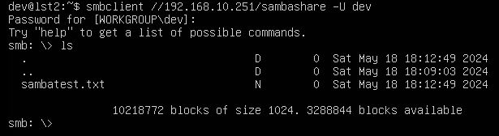
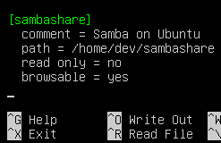
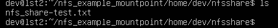
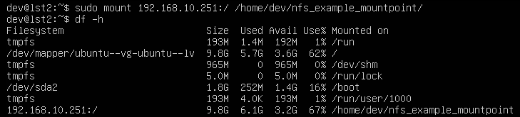
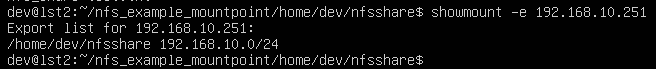

# Task #1: SAMBA

## 1. Install and configure SAMBA

- Run the following commands to install SAMBA:
    ```
    sudo apt-get update
    sudo apt-get install samba
    ```

- Verify the installation by running:
    ```
    whereis samba
    ```

## 2. Setting up Samba

- Create a directory for sharing:
    ```
    mkdir /home/<username>/sambashare/
    ```

- Create a file to place in the sambashare directory:
    ```
    cd sambashare
    touch testsamba.txt
    ```

## 3. Configure Samba

- Edit the Samba configuration file:
    ```
    sudo nano /etc/samba/smb.conf
    ```

- Add the following lines at the bottom of the file:
    ```
    [sambashare]
                    comment = Samba on Ubuntu
                    path = /home/username/sambashare
                    read only = no
                    browsable = yes
    ```

- Save the file (Ctrl-O) and exit (Ctrl-X).

## 4. Restart Samba and update firewall rules

- Restart Samba:
    ```
    sudo service smbd restart
    ```

- Update firewall rules:
    ```
    sudo ufw allow samba
    ```

## 5. Set up user accounts and connect to the share

- Set a Samba password for your user account:
    ```
    sudo smbpasswd -a username
    ```

- On a second machine, test the connection to the share:
    ```
    sudo apt-get update
    sudo apt install smbclient
    smbclient //<IP Address>/sambashare -U [username]
    ```

Submit the following:

- Screenshot from a client with the document folder displaying the shared file.
- Copy of your smb configuration files.




# Task #2: Network File System (NFS)

NFS allows a system to share directories and files with others over a network. By using NFS, users and programs can access files on remote systems almost as if they were local files.

## Benefits of NFS

- Local workstations use less disk space because commonly used data can be stored on a single machine and still remain accessible to others over the network.
- There is no need for users to have separate home directories on every network machine. Home directories could be set up on the NFS server and made available throughout the network.
- Storage devices such as floppy disks, CDROM drives, and USB Thumb drives can be used by other machines on the network. This may reduce the number of removable media drives throughout the network.

## Steps

### 1. Install and configure NFS

- Install the NFS Server:
    ```
    sudo apt install nfs-kernel-server
    ```

- Start the NFS server:
    ```
    sudo systemctl start nfs-kernel-server.service
    ```

- Create a directory for sharing:
    ```
    mkdir /home/<username>/nfsshare/
    ```

- Configure the directories to be exported by adding them to the /etc/exports file.

Note: Make sure any custom mount points you’re adding have been created.

- Apply the new config:
    ```
    sudo exportfs -a
    ```

### 2. Share a documents folder with NFS clients

On client:
- Update and install nfs-common:
    ```
    sudo apt update
    sudo apt install nfs-common
    ```

- Create a directory to mount the NFS share:
    ```
    sudo mkdir /home/dev/nfs_example_mountpoint
    ```

- Mount the NFS share:
    ```
    sudo mount <IP address>:/ /home/dev/nfs_example_mountpoint/
    ```

### 3. Place a file in the new documents folder with your name as the title

- In the NFS share, create a new file:
    ```
    touch nfs_share_test.txt
    ```

Submit the following:

- Screenshot from a client with the document folder displaying the shared file.  


- Copy of the showmount command on the client.
  


Extra:
To mount the share automatically at boot on the client, add an entry to /etc/fstab:  
Example: ```server-IP-address:/srv/nfs/sharedfolder /mnt/nfsshare nfs defaults 0 0```