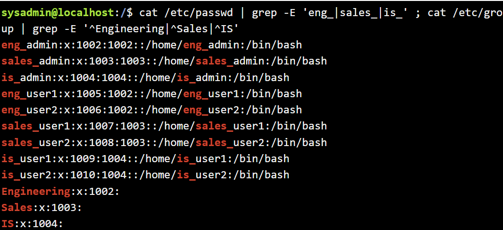
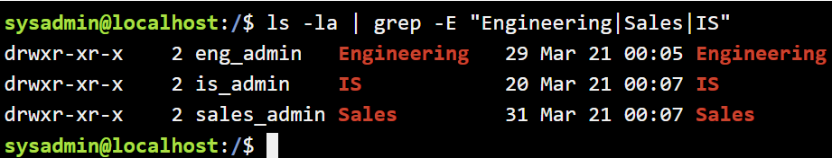
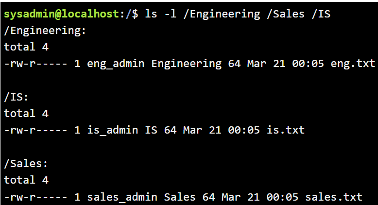

# Instructions

## Case Scenario 

As the Linux Administrator for fast-growing company, you have been tasked with creating, modifying, and removing user accounts from the Linux server. The company has just hired 9 new employees to fill 3 newly designed departments. The departments that have been created are Engineering, Sales and IS. The server must be setup with the appropriate files, folders, users, groups and permissions to ensure a successful launch of the newly designed departments.
***
## Objectives

- Create a directory at the root (/) of the file system for each department. This name should reflect the department name that will use the directory.

- Create a group for each department. This name should reflect the department name that the group will be assigned.

- Create an administrative user for each of the departments.
  - The user will have a Bash login shell.
  - The user will belong to the respective group for each department. This will need to be the user’s primary group.

- Create two additional users for each department.
  - The users will have a Bash login shell.
  - The users will belong to their respective group for each department. This will need to be the user’s primary group.

- For security reasons, the following modifications will need to be made to each of the departments' respective directories:
  - Ensure that the owner of each of the directories is the department administrator and the group ownership is the group for each department.
  - The department administrator will have full access to their respective department directories.
  - Ensure that only the owner of a file in the department’s directory can delete the file. The user will also have ownership of their respective department folders.
  - Normal users in each department will have full access (Read, Write and Execute) to their respective department folders.
  - The department folders will ONLY be accessible by users/administrators in each of the respective departments. Ensure that no one else will have permissions to the folders.

- Create a document in each of the department directories.

  - The ownerships on this file will be the same as the directory it is located in.
  - The document should contain only one line of text that states, “This file contains confidential information for the department.”
  - This file can be read by any user in the department, but can only be modified by the department administrator. No one else has permissions to this file.
***
Deliverables

- Use the appropriate command to verify each user and group has been created.
- Use the appropriate command to verify each user’s group assignment.
- Use the appropriate command to verify the directory creation and the permission settings.
- Use the appropriate command to verify the files are created in their respective directories.
***

# Solution
sysadmin@localhost:~$ cd /
sysadmin@localhost:/$ sudo mkdir Engineering Sales IS  
sysadmin@localhost:/$ sudo groupadd Engineering                                 
sysadmin@localhost:/$ sudo groupadd Sales                                       
sysadmin@localhost:/$ sudo groupadd IS  
sysadmin@localhost:/$ sudo useradd -g Engineering -s /bin/bash eng_admin        
sysadmin@localhost:/$ sudo useradd -g Sales -s /bin/bash sales_admin            
sysadmin@localhost:/$ sudo useradd -g IS -s /bin/bash is_admin   

sysadmin@localhost:/$ sudo useradd -g Engineering -s /bin/bash eng_user1  
sysadmin@localhost:/$ sudo useradd -g Engineering -s /bin/bash eng_user2  
sysadmin@localhost:/$ sudo useradd -g Sales -s /bin/bash sales_user1            
sysadmin@localhost:/$ sudo useradd -g Sales -s /bin/bash sales_user2  
sysadmin@localhost:/$ sudo useradd -g IS -s /bin/bash is_user1                  
sysadmin@localhost:/$ sudo useradd -g IS -s /bin/bash is_user2   

Verify:
Use the appropriate command to verify the directory creation and the permission settings.

sysadmin@localhost:/$ ls -la | grep -E "Engineering|Sales|IS"                   
drwxr-xr-x    2 root root    6 Mar 20 22:51 Engineering                         
drwxr-xr-x    2 root root    6 Mar 20 22:51 IS                                  
drwxr-xr-x    2 root root    6 Mar 20 22:51 Sales  

sysadmin@localhost:/$ sudo chown eng_admin:Engineering /Engineering             
sysadmin@localhost:/$ sudo chown sales_admin:Sales /Sales                       
sysadmin@localhost:/$ sudo chown is_admin:IS /IS  

sysadmin@localhost:/$ ls -la | grep -E "Engineering|Sales|IS"                   
drwxr-xr-x    2 eng_admin   Engineering    6 Mar 20 22:51 Engineering           
drwxr-xr-x    2 is_admin    IS             6 Mar 20 22:51 IS                    
drwxr-xr-x    2 sales_admin Sales          6 Mar 20 22:51 Sales 

sysadmin@localhost:/$ sudo nano /Engineering/eng.txt
 - Add "This file contains confidential information for the department." to eng.txt crtl+x, yes, enter  

sysadmin@localhost:/$ sudo cp -p /Engineering/eng.txt /Sales/sales.txt          
sysadmin@localhost:/$ sudo cp -p /Engineering/eng.txt /IS/is.txt

Changing file permissions in department directories:  
sysadmin@localhost:/Engineering$ sudo chown eng_admin:Engineering eng.txt  
sysadmin@localhost:/Engineering$ sudo chmod 640 eng.txt  
sysadmin@localhost:/$ sudo chown sales_admin:Sales /Sales/sales.txt             
sysadmin@localhost:/$ sudo chmod 640 /Sales/sales.txt                           
sysadmin@localhost:/$ sudo chown is_admin:IS /IS/is.txt                         
sysadmin@localhost:/$ sudo chmod 640 /IS/is.txt 

Deliverables:  
Use the appropriate command to verify each user and group has been created.  
Use the appropriate command to verify each user’s group assignment.  
sysadmin@localhost:/$ cat /etc/passwd | grep -E 'eng_|sales_|is_' ; cat /etc/group | grep -E '^Engineering|^Sales|^IS'    

Use the appropriate command to verify the directory creation and the permission settings.  
sysadmin@localhost:/$ ls -la | grep -E "Engineering|Sales|IS" 

Use the appropriate command to verify the files are created in their respective directories.  
sysadmin@localhost:/$ ls -l /Engineering /Sales /IS  
